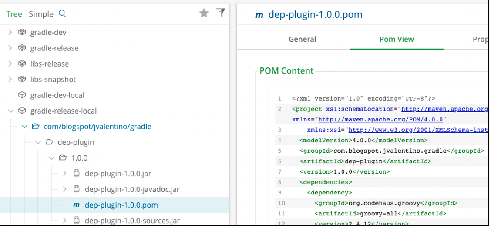

## 4.1 Compile Dependencies

### 4.1.1 Method 1: The Original

The Basic plugins thus far have not involved any dependencies, other than Groovy. Dependencies are important for Gradle, so that you don’t have to write everything from scratch. In this example, the plugin adds a task called “random,” that when executed uses the Apache Commons RNG library to generate the random number. This means that for this library to work, the dependencies for Apache Commons RNG must be on the classpath of the build using the plugin.

#### build.gradle

```groovy
version = '1.0.0'
group = 'com.blogspot.jvalentino.gradle'
archivesBaseName = 'dep-plugin'

dependencies {
    compile gradleApi()
    compile 'org.codehaus.groovy:groovy-all:2.4.12'

    compile 'org.apache.commons:commons-rng-simple:1.0'
    compile 'org.apache.commons:commons-rng-core:1.0'
    
    testCompile 'org.spockframework:spock-core:1.1-groovy-2.4'
}
```

The entirety of the build.gradle file is the same as was used in the Basic example, with the exception of the **version**, **group**, and **archivesBaseName**, with the addition of the dependencies on Apache Commons RNG. This means that the build handles Codenarc, JaCoCo, constructing the Jar with sources and docs, and uploading the assets to a Maven Repository.

#### src/main/groovy/com/blogspot/jvalentino/gradle/DepPlugin.groovy

```groovy
package com.blogspot.jvalentino.gradle

import org.gradle.api.Plugin
import org.gradle.api.Project

/**
 * <p>A basic gradle plugin.</p>
 * @author jvalentino2
 */
class DepPlugin implements Plugin<Project> {
    void apply(Project project) {
        project.task('random', type:RandomTask)
    }
}
```

The purpose of this plugin to declare the **random** task.

#### src/main/groovy/com/blogspot/jvalentino/gradle/RandomTask.groovy

```groovy
package com.blogspot.jvalentino.gradle

import org.gradle.api.DefaultTask
import org.gradle.api.tasks.TaskAction

import org.apache.commons.rng.UniformRandomProvider
import org.apache.commons.rng.simple.RandomSource

/**
 * <p>Generates a random number.</p>
 * @author jvalentino2
 */
@SuppressWarnings(['Println'])
class RandomTask extends DefaultTask {

    @TaskAction
    void perform() {
        UniformRandomProvider rng = RandomSource.create(RandomSource.MT)

        double random = rng.nextDouble()
        println "RANDOM: ${random}"
    }
}
```

The task prints a random number, using the Apache Commons RNG library, to the command-line.

#### Building the plugin Jar

```bash
dep-plugin$ gradlew jar
:compileJava NO-SOURCE
:compileGroovy
:processResources
:classes
:jar

BUILD SUCCESSFUL
```

The **jar** task can be used to quickly construct the Jar file, without check or test, and generate the file **build/libs/dep-plugin-1.0.0.jar**.

 

#### plugin-tests/local/build.gradle (won’t work)

```groovy
buildscript {
	repositories {
		flatDir {
			dirs '../../build/libs'
		}
		jcenter()
		
	}
	dependencies {
		classpath 'com.blogspot.jvalentino.gradle:dep-plugin:1.0.0'
	}
}

apply plugin: 'dep-plugin'
```

The build for the plugin test references the plugin jar as it sits on the file system, but this isn’t going to work…

#### Manually testing the task, and failing

```bash
dep-plugin/plugin-tests/local$ gradlew random

FAILURE: Build failed with an exception.

* What went wrong:
Execution failed for task ':random'.
> org/apache/commons/rng/simple/RandomSource
```

Attempting to run the task for our newly built plugin, because one or more classes that come from the Apache Commons RNG library cannot be found. This should be expected, if you consider that the solo asset constructed, the plugin jar, doesn’t contain any dependency information. Dependency information is expected to come from a POM, which wasn’t generated, and isn’t referenced even if it was using the **flatDir** method of reference.

#### plugin-tests/local/build.gradle (works)

```groovy
buildscript {
	repositories {
		flatDir {
			dirs '../../build/libs'
		}
		jcenter()
		
	}
	dependencies {
	      classpath 'com.blogspot.jvalentino.gradle:dep-plugin:1.0.0'
             classpath 'org.apache.commons:commons-rng-simple:1.0'
             classpath 'org.apache.commons:commons-rng-core:1.0'
	}
}

apply plugin: 'dep-plugin'
```

To get the missing classes using the **flatDir** method of reference, the local build must add **compile** dependencies from the plugin’s build, as **classpath** dependencies.

#### Manually testing the plugin, and having it work

```bash
dep-plugin/plugin-tests/local$ gradlew random

> Task :random 
RANDOM: 0.4339793570068109
```

With the dependencies for Apache Common RNG now available via the classpath, the **random** task works.

#### Publishing the Library

```bash
dep-plugin$ gradlew clean build jacocoTestReport uploadArchives
:clean
:compileJava NO-SOURCE
:compileGroovy
:processResources
:classes
:jar
:groovydoc
:javadocJar
:sourcesJar
:assemble
:codenarcMain
:codenarcTest
:compileTestJava NO-SOURCE
:compileTestGroovy
:processTestResources NO-SOURCE
:testClasses
:test
:check
:build
:jacocoTestReport
:uploadArchives

BUILD SUCCESSFUL
```

Running the standard commands for test, build, and deploy, the library is uploaded to the locally running Maven repository, which includes this library’s dependency manifest as a POM:



#### plugin-tests/remote/build.gradle

```groovy
buildscript {
	repositories {
		maven {
			url 'http://localhost:8081/artifactory/gradle-release'
		}
		jcenter()
		
	}
	dependencies {
             classpath 'com.blogspot.jvalentino.gradle:dep-plugin:1.0.0'
	}
}

apply plugin: 'dep-plugin'
```

The purpose of this build is to demonstrate the usage of the plugin library, as a non-local dependency as before. There is no reference to the local file system, so the only location that can contain the library is one of the listed repositories. Additionally, this demonstrates that when using a repository that the POM information is included, so there is no need to declare the dependencies of the library in use.

 

#### Manually testing the remote project

```bash
dep-plugin/plugin-tests/remote$ gradlew random
Download http://localhost:8081/artifactory/gradle-release/com/blogspot/jvalentino/gradle/dep-plugin/1.0.0/dep-plugin-1.0.0.pom
Download http://localhost:8081/artifactory/gradle-release/com/blogspot/jvalentino/gradle/dep-plugin/1.0.0/dep-plugin-1.0.0.jar

> Task :random 
RANDOM: 0.9472953841698855

BUILD SUCCESSFUL
```

​      The first time that this test is executed, the library dependency that contains the plugin with its POM will be downloaded and cached. In this output, observe that it is coming from the local Artifactory Maven repository. It is specifically the POM, that tells the running build that it must also have the dependencies for Apache Common RNG to be able to work.


